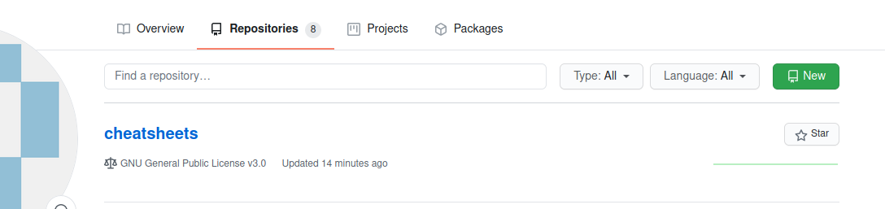
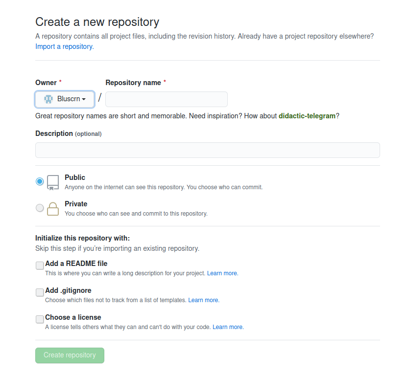
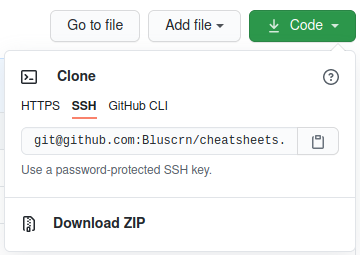

# Git Cheatsheet

The first step is to create a new repository on (Github, Gitea, Gitlab, etc.) we will use Github as an example.
*****

Log into your account and click **Repositories** -> **New**

Name the repo, choose Public or Private and click **Create Repository**

Copy the repo address

*****
