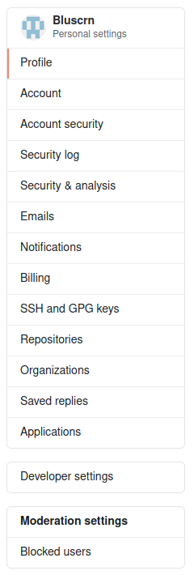
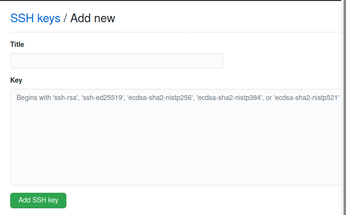

Git Cheatsheet
===

The first step is to create an account on Github. (Gitea, Gitlab, etc. will be similar)

## Setting up ssh keys

Next click on your profile icon and **Settings**


Click **SSH and GPG keys** on the left side of the screen



Click **New SSH Key**


*****
### Check for existing keys

In a terminal type

`ls -al ~/.ssh`

Check the directory listing to see if you already have a public SSH key. By default, the filenames of the public keys are one of the following:

- id_rsa.pub
- id_ecdsa.pub
- id_ed25519.pub

If you don't have an existing public and private key pair, or don't wish to use any that are available to connect to GitHub, then continue on, otherwise skip to [Add your key to the ssh-agent](#add-your-key-to-the-ssh-agent)

### Generate a key

In a terminal type

`ssh-keygen -t rsa -b 4096 -C "your_email@example.com"`

When prompted for a filename either press **Enter** to accept the default or name your new key

`> Enter a file in which to save the key (/home/you/.ssh/id_rsa): [Press enter]`

When prompted for a passphrase you can press **Enter** to leave the key __*unsecured*__ or set a passphrase

```
> Enter passphrase (empty for no passphrase): [Type a passphrase]
> Enter same passphrase again: [Type passphrase again]
```

### Add your key to the ssh-agent

Start the ssh-agent in the background

`eval "$(ssh-agent -s)"`

Add your SSH **private key** to the ssh-agent

`ssh-add ~/.ssh/id_rsa`

If you created your key with a different name, or if you are adding an existing key that has a different name, replace `id_rsa` in the command with the name of your private key file.

### Add your key to Github

In a terminal type

`cat ~/.ssh/id_rsa.pub`

Then copy the output

*****

#### Back on the Github **New SSH Key** screen

Name your key with a recognizable **Title** and paste the copied key into the key box



This key should begin with **ssh-rsa** and end with __*username@hostname*__

*****

Creating a new repository.
===

Log into your account and click **Repositories** -> **New**


*****

Name the repo, choose **Public** or **Private** and click **Create Repository**


*****

Copy the repo address


*****

Adding local files to your repository
===
 
In a terminal `cd` to the folder that you want to add to git then:

`git init`

`git config --local user.name "Your_git_Username"`

`git config --local user.email "Your_Registered_Email@Your_Provider"`

If you only use one account, you can change `--local` to `--global`

Create a .gitignore file with any editor and add files that you do not want tracked

```txt
# Example .gitignore #
github_setup.sh
git-v2.sh
untracked.md
not_ready.md
directory/
another/sub-directory/
```

Add your files to git

`git add .`

`git remote add origin`  `git@github.com:username/new_repo` where everything after origin is your repo address

`git push -u origin main`
